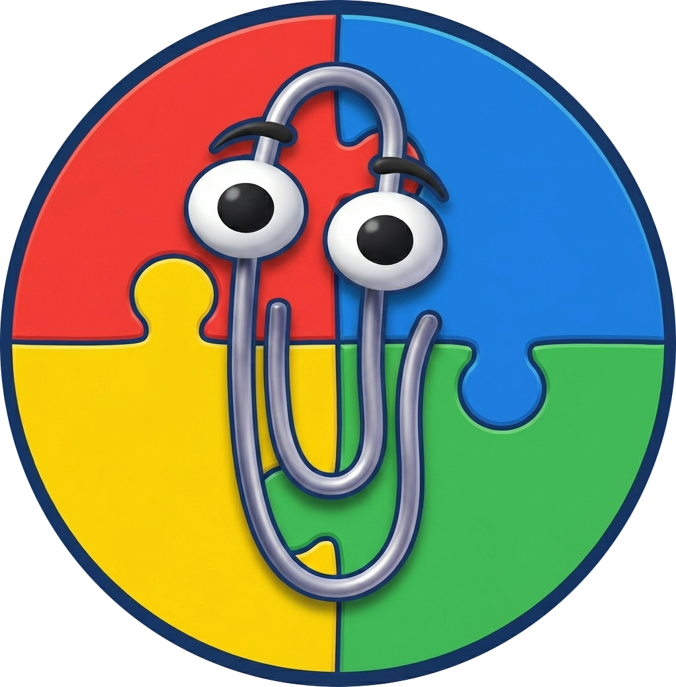

<p align="center">
  
</p>
<p align="center">
  
  
  
  
  
</p>
<h1 align="center">Office Buddies</h1>

This project brings classic Office-style assistants into a modern LLM chat app with a 90s desktop vibe.

Clippy is still here (and yes, still iconic), but Office Buddies treats the app as a home for the broader assistant cast too: Bonzi, F1, Genie, Genius, Links, Merlin, Peedy, Rocky, Rover, and others added over time.

Under the hood, it supports local GGUF models and optional remote providers, while keeping the UI intentionally nostalgic.
It is also a tribute to the nostalgic assistants that marked generations.

## What This Fork Is

This repository is a personal fork of [felixrieseberg/clippy](https://github.com/felixrieseberg/clippy), expanded to support multiple assistants, richer animation behavior, and multi-provider AI backends.

This fork is maintained for self-taught and educational purposes, mainly to explore AI capabilities, study implementation patterns, and learn from the open-source community.

It is made with respect for:

- The original Clippy project and its author
- Microsoft and the Office Assistant legacy
- The creators and preservers of these assistant assets

This app is not affiliated with, endorsed by, or sponsored by Microsoft.

## Core Features

- Multiple classic assistants, each with their own animation set and sounds.
- Local-first chat with GGUF models through llama.cpp / `node-llama-cpp`.
- Optional remote providers: OpenAI, Google, and Maritaca.
- Provider-aware model selection from API-backed model lists.
- Configurable prompt and generation parameters.
- Native-feeling context menu for choosing and previewing assistant animations.
- Buddy actions for selected text (define, summarize, simplify, rewrite).
- Windows global shortcuts for Buddy actions:
  - `Win + F2`: Define
  - `Win + F3`: Summarize
  - `Win + F5`: Rewrite in a friendlier tone
- Windows-98-inspired UI and interaction patterns.

## Buddy Actions and Speech Balloon

When text is selected, Office Buddies can respond in a classic speech balloon flow.

- In app windows, use right-click `Buddy` actions on selected text.
- On Windows, global shortcuts can trigger Buddy actions for selected foreground text.
- Buddy replies are shown in a classic assistant balloon with:
  - close (`X`) control
  - quick actions (`Try again`, `Open in chat`)
  - improved multiline formatting for long definitions and rewrites
- During shortcut-driven actions, the assistant uses `Thinking` / `Processing` animation behavior.

## Providers

Configure providers in `Settings > Model`.

- `Local (GGUF)`: runs on your machine via `@electron/llm`.
- `OpenAI`: API key + model selection.
- `Google`: API key + model selection.
- `Maritaca`: API key + model selection.

Remote provider requests are executed in the Electron main process via IPC.

## Downloading Local Models

For local mode, GGUF models are supported. Good sources include quantizations from:

- [TheBloke](https://huggingface.co/thebloke)
- [Unsloth](https://huggingface.co/unsloth)

## Build Windows EXE

To generate a Windows installer `.exe`, run:

```bash
npm install
npm run make
```

The generated installer is placed under `out/make/squirrel.windows/<arch>/`, for example:

- `out/make/squirrel.windows/x64/OfficeBuddies-<version>-setup-x64.exe`

If you only want an unpacked app build (no installer), run:

```bash
npm run package
```

That output goes to `out/Office Buddies-win32-<arch>/`.

## Editing Agent Animations (Frame Arrays)

Animation files live at `assets/agents/<Agent>/agent.js`.

### Animation Studio (Recommended)

Animation Studio is a standalone Win98-style visual editor for assistant animations (`agent.js`), sprite-map frame picking (`map.png`), and sound assignment (`sounds-mp3.js` / `sounds-ogg.js`).

Its purpose is to speed up animation authoring and reduce manual timeline editing mistakes.

Quick start on Windows:

- `run-animation-studio.cmd`

Detailed docs:

- [`tools/animation-studio/README.md`](tools/animation-studio/README.md)
- [`tools/animation-studio/TUTORIAL.md`](tools/animation-studio/TUTORIAL.md)

## Scope and Intent

This project is not trying to beat every chat client in features.

The goal is simpler: combine capable modern AI with a playful, classic assistant experience that feels personal and a little weird in a good way.

## Acknowledgements

Special thanks to:

- [Felix Rieseberg](https://github.com/felixrieseberg) for creating and open-sourcing the original Clippy app.
- Microsoft, for the Office Assistant legacy and for Electron.
- [Kevan Atteberry](https://www.kevanatteberry.com/) for designing Clippy.
- [Jordan Scales (@jdan)](https://github.com/jdan) for the Windows 98 visual language.
- [Alex Meub's Windows 98 Icons](https://win98icons.alexmeub.com/) as the source for some icons used in this project.
- [Pooya Parsa (@pi0)](https://github.com/pi0) and contributors who helped preserve/extract assistant animation data.
- [node-llama-cpp](https://github.com/withcatai/node-llama-cpp) for making local inference practical in Node/Electron.
